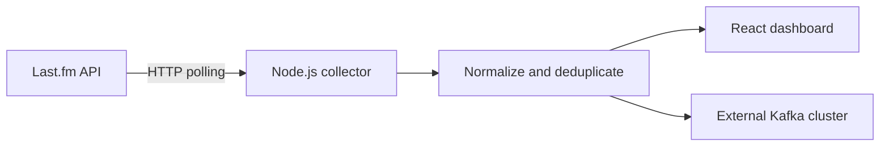

# Last.fm Scrobble Stream

> **Note:** The initial version of this project was developed with Google AI Studio as part of a hands-on exploration of the platform and its capabilities.

A standalone, polling-based collector that retrieves real listening activity from the [Last.fm API](https://www.last.fm/api) and transforms it into events that can be inspected locally or published to Apache Kafka.

This project was created for learning and experimentation with event-driven systems. It is intentionally separate from the Kafka infrastructure and from any downstream consumers or processing applications.

## What this project does

- Polls `user.getRecentTracks` for one or more Last.fm users.
- Converts recent tracks and current playback data into a consistent event format.
- Prevents duplicate events caused by repeated polling.
- Displays collected events in a React dashboard through Server-Sent Events (SSE).
- Runs without Kafka in dry-run mode.
- Optionally publishes events to an externally managed Kafka cluster.

The application uses real Last.fm data only. It does not fall back to mock, random, or synthetic listening data when the API is unavailable.

## Architecture



The repository contains two main parts:

- **Node.js backend:** communicates with Last.fm, manages polling and deduplication, exposes the local HTTP API and publishes events to Kafka when enabled.
- **React frontend:** displays collector status and events received from the backend. It does not access Last.fm or Kafka directly.

The Kafka brokers, topics, consumers, stream-processing applications and databases belong to a separate Kafka learning environment.

### Main components

| Component | Responsibility |
| --- | --- |
| `LastFmClient` | Calls the Last.fm API and normalizes its responses. |
| `CollectorEngine` | Coordinates polling for the configured users. |
| `EventDeduplicator` | Prevents the same event from being emitted on consecutive polling cycles. |
| `KafkaScrobbleProducer` | Publishes events to an external Kafka cluster when enabled. |
| React dashboard | Receives events through SSE and provides a local inspection interface. |

## Requirements

- Node.js 18 or later
- A [Last.fm API key](https://www.last.fm/api/account/create)
- An Apache Kafka cluster only when Kafka publishing is enabled

## Getting started

Clone the repository and install the dependencies:

```bash
git clone <repository-url>
cd lastfm-scrobble-stream
npm install
```

Create your local configuration:

```bash
cp .env.example .env
```

At minimum, provide a Last.fm API key and one or more usernames:

```env
LASTFM_API_KEY=your_lastfm_api_key
LASTFM_USERS=your_lastfm_username
KAFKA_PRODUCER_ENABLED=false
```

Never commit your `.env` file or real credentials.

Start the application in development mode:

```bash
npm run dev
```

This starts the Node.js server and the React interface. The default HTTP port is `3000`.

## Configuration

| Variable | Required | Default | Description |
| --- | --- | --- | --- |
| `LASTFM_API_KEY` | Yes | — | Last.fm Audioscrobbler API key. |
| `LASTFM_USERS` | Yes | — | Comma-separated usernames to monitor. |
| `LASTFM_POLL_INTERVAL_MS` | No | `10000` | Interval between polling cycles in milliseconds. Minimum: `2000`. |
| `LASTFM_LIMIT` | No | `5` | Number of recent tracks requested per user. Range: `1`–`50`. |
| `KAFKA_PRODUCER_ENABLED` | No | `false` | Enables publishing to Kafka. |
| `KAFKA_BOOTSTRAP_SERVERS` | When Kafka is enabled | `localhost:9092` | Comma-separated Kafka broker addresses. |
| `KAFKA_TOPIC` | No | `lastfm.scrobbles` | Destination topic. |
| `KAFKA_CLIENT_ID` | No | `lastfm-collector-producer` | Producer identifier shown in Kafka logs. |
| `KAFKA_COMPRESSION` | No | `gzip` | Compression codec: `none`, `gzip`, `snappy`, `lz4` or `zstd`. |
| `KAFKA_ACKS` | No | `-1` | Kafka acknowledgement level. |
| `KAFKA_PRODUCER_RETRIES` | No | `5` | Retry limit for transient publishing failures. |
| `KAFKA_PRODUCER_TIMEOUT_MS` | No | `30000` | Kafka request timeout in milliseconds. |
| `KAFKA_SECURITY_PROTOCOL` | No | `PLAINTEXT` | Connection protocol: `PLAINTEXT`, `SSL`, `SASL_PLAINTEXT` or `SASL_SSL`. |
| `KAFKA_SASL_MECHANISM` | For SASL | — | `plain`, `scram-sha-256` or `scram-sha-512`. |
| `KAFKA_SASL_USERNAME` | For SASL | — | Authentication username. |
| `KAFKA_SASL_PASSWORD` | For SASL | — | Authentication password or secret. |
| `PORT` | No | `3000` | HTTP server port. |

## Running modes

### Dry-run mode

Dry-run mode is the default and does not require Kafka:

```env
LASTFM_API_KEY=your_lastfm_api_key
LASTFM_USERS=your_lastfm_username
KAFKA_PRODUCER_ENABLED=false
```

The collector continues to retrieve and deduplicate real Last.fm data. Generated events are logged and sent to the dashboard, but no connection to Kafka is attempted.

Use this mode to validate the Last.fm integration and inspect the event payload before connecting the project to Kafka.

### Kafka producer mode

Start your Kafka environment separately, then configure this project with an address it can reach:

```env
KAFKA_PRODUCER_ENABLED=true
KAFKA_BOOTSTRAP_SERVERS=localhost:9092
KAFKA_TOPIC=lastfm.scrobbles
KAFKA_CLIENT_ID=lastfm-collector-producer
```

Restart the application after changing the configuration.

The correct broker address depends on where each application is running:

| Collector location | Kafka location | Typical broker address |
| --- | --- | --- |
| Local machine | Same local machine | `localhost:9092` |
| Docker container | Host machine | `host.docker.internal:9092` |
| Docker network | Container in the same network | `kafka:9092` |

To inspect the published events using the Kafka CLI:

```bash
kafka-console-consumer \
  --bootstrap-server localhost:9092 \
  --topic lastfm.scrobbles \
  --from-beginning
```

## Event format

Events are serialized as JSON. The Last.fm username is used as the Kafka message key so that events for the same listener are routed to the same partition.

```json
{
  "eventId": "lastfm-rj-1710000000-0",
  "eventType": "TRACK_SCROBBLED",
  "schemaVersion": "1.0.0",
  "timestamp": 1710000000000,
  "user": {
    "username": "rj"
  },
  "track": {
    "name": "Myth",
    "artist": "Beach House",
    "album": "Bloom",
    "mbid": "60a4b75a-38bb-4eb9-b883-7c3858c16053",
    "url": "https://www.last.fm/music/Beach+House/_/Myth",
    "nowPlaying": false
  },
  "metadata": {
    "source": "lastfm",
    "ingestedAt": 1710000005120
  }
}
```

### Event types

- `TRACK_NOW_PLAYING`: represents the current playback reported by Last.fm. It does not include a permanent scrobble timestamp.
- `TRACK_SCROBBLED`: represents a track recorded in the user's listening history with a Last.fm timestamp.

`TRACK_NOW_PLAYING` and `TRACK_SCROBBLED` describe different stages of a listening session and may both be emitted for the same track.

## Polling and deduplication

Last.fm does not provide a native continuous event stream for this use case. The collector creates a near-real-time feed by polling `user.getRecentTracks` at a configurable interval.

Because consecutive responses can contain the same records, the application keeps a bounded in-memory set of event identifiers. Events already seen during the current process are not emitted again.

This strategy has two important limitations:

- Deduplication state is lost when the application restarts.
- Multiple collector instances do not share deduplication state.

Persistent or distributed deduplication should be implemented downstream if stronger delivery guarantees are required.

## Understanding `now playing`

The dashboard shows an event history, not a single mutable playback state. Older `TRACK_NOW_PLAYING` events remain visible after a newer track arrives because events are append-only.

Consumers that need one current track per user should maintain keyed state using the username and apply an expiration policy. Completed `TRACK_SCROBBLED` events should be treated as historical facts.

## Error handling and shutdown

The collector handles Last.fm API errors, invalid responses and rate-limit responses explicitly. Kafka connection and publishing failures are logged rather than replaced with fake data.

On `SIGINT` or `SIGTERM`, the application stops polling, closes active SSE connections and disconnects the Kafka producer.

## Development

Run the available project checks before submitting changes:

```bash
npm run lint
npm run build
```

To run the production build:

```bash
npm start
```

## Current scope

This repository focuses on collection and publication. It intentionally does not include:

- Kafka broker provisioning
- Topic management
- Kafka consumers
- Stream processing
- Persistent storage
- Analytics pipelines

Those concerns can evolve independently in the separate Kafka learning project.

## Possible next steps

- Add automated tests for event transformation, deduplication and configuration validation.
- Add event schema validation and compatibility checks.
- Add metrics for polling latency, API errors and Kafka delivery failures.
- Define a persistent deduplication strategy if restart-safe delivery becomes necessary.
- Build consumers with Kafka Streams, Apache Flink or Apache Spark.

